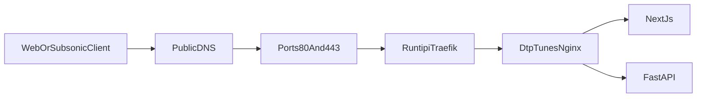

# Runtipi Custom Domain Deployment

## Recommended setup

Use a dedicated hostname such as `music.example.com`, with a DNS `A` record pointing to the home public IP and router ports 80/443 forwarded to the Runtipi host. Keep Cloudflare DNS in DNS-only mode for this hostname if Cloudflare manages the zone, avoiding an extra proxy hop for long audio streams. Runtipi’s Traefik will terminate HTTPS and route to the existing dtp-tunes nginx gateway.

Because dtp-tunes remains a standalone stack, its domain will not be configured through Runtipi’s “Expose app” screen. Docker labels will register the route directly with Traefik’s `myresolver` certificate resolver, following [Runtipi’s reverse-proxy model](https://runtipi.io/docs/learn/reverse-proxy) and [exposure requirements](https://runtipi.io/docs/guides/expose-your-apps).

## Compose and routing

- Add [`docker-compose.runtipi.yml`](../dtp-tunes/docker-compose.runtipi.yml) as a production overlay:
  - Attach only `gateway` to external network `runtipi_tipi_main_network`, while retaining the private dtp-tunes network for communication with `web` and `api`.
  - Add explicit Traefik HTTP-to-HTTPS redirect and secure router labels using `${DTP_TUNES_DOMAIN}`.
  - Set `traefik.docker.network=runtipi_tipi_main_network`, route to gateway port 80, and use `tls.certresolver=myresolver`.
  - Do not add Runtipi forward-auth middleware because native Subsonic clients cannot complete browser-oriented forward-auth; dtp-tunes authentication remains authoritative.
- Restrict the fallback gateway host mapping in [`docker-compose.yml`](../dtp-tunes/docker-compose.yml) to `127.0.0.1:${LOCAL_PORT:-8080}:80`, so port 8080 remains available for host diagnostics but is not exposed to the LAN/WAN.

## Domain-aware application configuration

- Extend [`.env.example`](../dtp-tunes/.env.example) with `DTP_TUNES_DOMAIN`, `LOCAL_PORT`, and deployment examples. In the Runtipi overlay, derive `APP_PUBLIC_URL=https://${DTP_TUNES_DOMAIN}` and production CORS from the same hostname to avoid configuration drift.
- Update [`gateway/nginx.conf`](../dtp-tunes/gateway/nginx.conf) to preserve Traefik’s incoming `X-Forwarded-Proto: https` rather than replacing it with the nginx-to-FastAPI HTTP scheme.
- Run Uvicorn with trusted proxy-header handling only inside the private Compose network. This ensures FastAPI detects HTTPS and emits `Secure`, HttpOnly session cookies while external clients cannot reach the API container directly.
- Keep streaming routes unbuffered through both proxies and preserve `Range`, `Content-Range`, cancellation, and long read timeouts.

## Deployment guide and safeguards

- Add a dedicated Runtipi section to [`README.md`](../dtp-tunes/README.md) and a runbook at [`docs/RUNTIPI_DEPLOYMENT.md`](../dtp-tunes/docs/RUNTIPI_DEPLOYMENT.md) covering:
  - DNS record, public-IP/CGNAT check, router forwarding, firewall, and confirmation that Runtipi already owns ports 80/443.
  - Creating secrets, choosing a non-conflicting hostname, verifying `runtipi_tipi_main_network`, and starting with both Compose files.
  - Why the Runtipi dashboard does not manage this standalone app’s exposure or lifecycle.
  - HTTPS and Subsonic client base URL (`https://music.example.com`) setup.
  - Rollback, certificate troubleshooting, and a Cloudflare Tunnel/VPN fallback if the ISP uses CGNAT.
- Do not commit a real domain, admin password, or encryption key; keep deploy-specific values in `.env`.

## Verification

- Validate the merged configuration with `docker compose -f docker-compose.yml -f docker-compose.runtipi.yml config` and confirm only `gateway` joins the Runtipi network.
- Verify the external network exists, all services become healthy, HTTP redirects to HTTPS, Let’s Encrypt issues the expected certificate, and `/health` works through the public hostname.
- Confirm login responses set `Secure; HttpOnly; SameSite=Lax`, byte-range audio returns `206 Partial Content`, `/rest/ping.view` works through HTTPS, and a representative Subsonic client can authenticate and stream.
- Confirm direct access is unavailable on the server’s LAN IP at port 8080 while `127.0.0.1:8080` remains usable for local diagnostics.