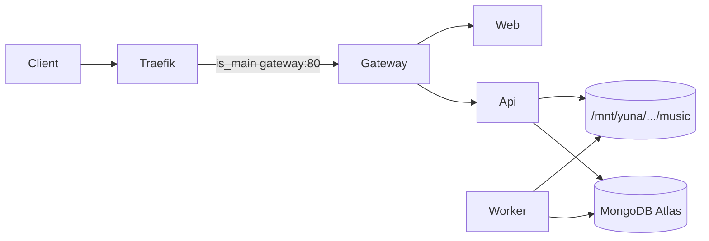

# Runtipi custom app for dtp-tunes

## Deploy root (locked)

On Rath, the live tree is:

```text
/home/yui/apps/dtp/dtp-tunes
```

All standalone compose, `.env`, Dockerfiles, and `gateway/nginx.conf` live here. The custom-app YAML will **bind-mount** nginx config from this path and you will **build images** from this path after code pulls. Runtipi will own container lifecycle; this directory remains the source/build checkout (not moved under `~/apps/runtipi/`).

## What the screenshot is

Runtipi’s **Create App** UI (`/apps/create`) is the **personal custom-app** path ([Runtipi docs: create your own app store](https://runtipi.io/docs/guides/create-your-own-app-store) explicitly says: if you only want apps for yourself, use create custom app instead of a full app store).

It is **not** the same as:

| Mechanism | What you have today | Role |
| --- | --- | --- |
| Standalone compose + labels | [`docker-compose.yml`](docker-compose.yml) + [`docker-compose.runtipi.yml`](docker-compose.runtipi.yml) | Current production path ([`docs/RUNTIPI_DEPLOYMENT.md`](docs/RUNTIPI_DEPLOYMENT.md)) |
| `user-config` overrides | [`runtipi-user-configs/updated/navidrome.yml`](/Users/argo/Code/dtp/runtipi-user-configs/updated/navidrome.yml) | Patch **store** apps (Jellyfin/Navidrome volumes) |
| Create custom app | Screenshot / YAML Editor | Dashboard-managed multi-service app with auto Traefik |
| Custom app store | GitHub repo + `config.json` | Shareable/reusable store (overkill for one host) |



## Critical differences vs current stack

1. **Images, not `build:`** — Create App expects `image:` (UI “Image” field). Your api/web use `build:`. On Rath, build once and tag local images the custom app can pull from the host Docker daemon.
2. **Traefik via `x-runtipi`, not hand-written labels** — Mark `gateway` with `is_main: true` and `internal_port: 80`. Drop the manual labels from [`docker-compose.runtipi.yml`](docker-compose.runtipi.yml); Runtipi generates routers onto `runtipi_tipi_main_network`.
3. **Do not attach Runtipi forward-auth** — Same rule as today: Subsonic clients cannot complete browser auth. When exposing the app, use a custom domain **without** Runtipi’s auth middleware (app owns cookie + Subsonic auth).
4. **Music mount is host reality** — Bind `/mnt/yuna/navidrome/music:/music:ro` (same pattern as Navidrome’s user-config). Create App will **not** fix an empty NAS mount; `/music` must have files on the host first (`seen=0` scans were because that path was empty).
5. **Stop the standalone stack first** — Two stacks claiming `Host(tunes.waifu.bond)` will fight in Traefik.

## Recommended implementation path

Use **YAML Editor** (bottom-right on Create App), not the per-service Essentials form — you need 4 services + nginx conf mount + healthchecks.

### Step 0 — Prerequisites on Rath

- Confirm NAS music is mounted and non-empty: `ls /mnt/yuna/navidrome/music | head`
- Stop standalone stack from the deploy root:

```bash
cd /home/yui/apps/dtp/dtp-tunes
docker compose -f docker-compose.yml -f docker-compose.runtipi.yml down
```

- Build/tag images from the same tree (reuse values from `/home/yui/apps/dtp/dtp-tunes/.env` when filling Create App env):

```bash
cd /home/yui/apps/dtp/dtp-tunes
docker build -t dtp-tunes-api:local ./api
docker build -t dtp-tunes-web:local ./web
```

### Step 1 — Create App in dashboard

- App name: `dtp-tunes` (lowercase/hyphens)
- Open **YAML Editor** and paste a dynamic compose shaped like:

```yaml
services:
  gateway:
    image: nginx:1.27-alpine
    volumes:
      - /home/yui/apps/dtp/dtp-tunes/gateway/nginx.conf:/etc/nginx/nginx.conf:ro
    depends_on:
      - web
      - api
    x-runtipi:
      is_main: true
      internal_port: 80

  web:
    image: dtp-tunes-web:local
    environment:
      - NEXT_PUBLIC_API_BASE=
      - API_INTERNAL_URL=http://api:8000
    depends_on:
      - api

  api:
    image: dtp-tunes-api:local
    user: "1000:1000"   # match host/NAS ownership; adjust via id -u / id -g
    command: ["uvicorn","app.main:app","--host","0.0.0.0","--port","8000","--proxy-headers","--forwarded-allow-ips=*"]
    environment:
      - APP_PUBLIC_URL=${APP_PROTOCOL}://${APP_DOMAIN}
      - CORS_ORIGINS=${APP_PROTOCOL}://${APP_DOMAIN}
      - MONGODB_URI=...          # Atlas URI
      - MONGODB_DB=DTP
      - MONGODB_COLLECTION_PREFIX=tunes_
      - ADMIN_USERNAME=argo
      - ADMIN_PASSWORD=...
      - APP_ENCRYPTION_KEY=...
      - MUSIC_PATH=/music
      - CACHE_PATH=/cache
      # plus remaining .env knobs as needed
    volumes:
      - /mnt/yuna/navidrome/music:/music:ro
      - ${APP_DATA_DIR}/cache:/cache
    healthcheck:
      test: ["CMD","python","-c","import urllib.request; urllib.request.urlopen('http://127.0.0.1:8000/health')"]
      interval: 10s
      timeout: 5s
      retries: 12
      start_period: 15s

  worker:
    image: dtp-tunes-api:local
    user: "1000:1000"
    command: ["python","-m","app.worker.main"]
    environment:
      # same Mongo/secrets/MUSIC_PATH/CACHE_PATH as api
    volumes:
      - /mnt/yuna/navidrome/music:/music:ro
      - ${APP_DATA_DIR}/cache:/cache
    depends_on:
      - api

x-runtipi:
  schema_version: 2
```

Notes:

- Service DNS names `api` / `web` must stay as-is — [`gateway/nginx.conf`](gateway/nginx.conf) proxies to `http://api:8000` and `http://web:3000`.
- No bundled `mongodb` (Atlas), matching current Pi setup.
- Cache under `${APP_DATA_DIR}/cache` so Runtipi owns writable app data; music stays on `/mnt/yuna`.
- Prefer mounting the existing repo `nginx.conf` (or copy it into `${APP_DATA_DIR}` once) so Traefik→nginx still sets `X-Forwarded-Proto` for Secure cookies.

### Step 2 — Expose domain

- In the app settings, expose on `tunes.waifu.bond` (or your `DTP_TUNES_DOMAIN`).
- Leave Runtipi auth **off**.
- DNS A record + Let’s Encrypt via Runtipi’s `myresolver` (same Traefik as today).

### Step 3 — Verify

- `docker exec` into worker: `find /music -type f | wc -l` > 0
- Worker logs: scan `seen=` > 0 (not `seen=0`)
- `https://tunes.waifu.bond/health`, web login, Subsonic ping

### Step 4 — Repo follow-ups (after UI works)

Add under dtp-tunes (or runtipi-user-configs):

- `runtipi/dtp-tunes.docker-compose.yml` — the dynamic compose template above (secrets as `${...}` placeholders)
- Update [`docs/RUNTIPI_DEPLOYMENT.md`](docs/RUNTIPI_DEPLOYMENT.md) with a “Custom app (dashboard)” section: build tags, stop standalone, paste YAML, expose without auth, music mount checklist
- Optional later: private app-store package (`config.json` + metadata) if you want one-click reinstall

## What Create App does **not** replace

- Building/publishing new api/web images after code changes — still:

```bash
cd /home/yui/apps/dtp/dtp-tunes
docker build -t dtp-tunes-api:local ./api
docker build -t dtp-tunes-web:local ./web
# then restart/update the custom app in Runtipi
```

- Fixing an unmounted/empty `/mnt/yuna/...` (host mount issue)
- Bundled Mongo on Pi 4 (keep Atlas)

## Decision locked in this plan

Use **Create custom app + YAML Editor** as the migration target (not a full custom app store, not more `user-config` overrides). Keep Atlas; mount Navidrome’s music path read-only; gateway as `is_main`. Source/build checkout stays at **`/home/yui/apps/dtp/dtp-tunes`**.
