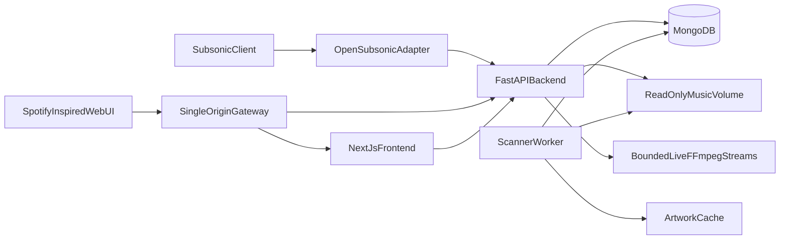

# Docker Music Server V1

## Architecture and V1 boundaries

- Create a Next.js App Router frontend in [`web`](../dtp-tunes/web) using TypeScript, Tailwind CSS v4, COSS primitives, and the `frontend-design`/`coss`/`coss-particles` guidance from `sway-sched`.
- Create a separate FastAPI backend in [`api`](../dtp-tunes/api). Keep HTTP handlers thin and share domain, repository, protocol, and media modules between the API and scanner worker.
- Deploy the system through [`docker-compose.yml`](../dtp-tunes/docker-compose.yml):
  - `gateway`: one public origin that routes `/`, `/api`, and `/rest` without buffering media responses.
  - `web`: Next.js standalone server for the frontend only.
  - `api`: FastAPI for web JSON APIs, OpenSubsonic endpoints, cover art, byte-range file streaming, and concurrency-bounded live FFmpeg transcoding.
  - `worker`: the same Python backend image running MongoDB-leased scan jobs for filesystem traversal, metadata extraction, and cover-art caching.
  - `mongodb`: private persistent metadata store; music remains in a read-only `/music` bind mount and generated artwork/cache in a separate writable volume.
- Treat “all Subsonic clients” as a compatibility target, not a literal guarantee. Publish a tested OpenSubsonic profile and representative client matrix; unsupported optional families in V1 are podcasts, video, chat, sharing, internet radio, and jukebox.

## Backend and data model

- Add reusable Python modules under [`api/app`](../dtp-tunes/api/app) for PyMongo async connection pooling, repositories, authentication, media range responses, FFmpeg process limits/cancellation, XML/JSON serialization, and atomic Mongo-backed scan job leases.
- Model and index `users`, `apiKeys`, `artists`, `albums`, `songs`, `genres`, `playlists`, `stars`, `playHistory`, `playQueues`, and `scanJobs`. Keep stable opaque IDs, normalized searchable fields, unique normalized usernames and file paths, and ordered playlist entries.
- Implement first-run admin bootstrap from Docker secrets/environment, Argon2id web-password hashes, secure cookie sessions, role checks, rate limits, and revocable API keys.
- Support legacy Subsonic token authentication (`t = MD5(password + salt)`) only through an explicitly documented AES-GCM encrypted compatibility credential protected by `APP_ENCRYPTION_KEY`; never store plaintext or log credentials. This reversible secret is an unavoidable security tradeoff for older clients, while web authentication remains Argon2id.
- Build the scanner in [`api/app/worker`](../dtp-tunes/api/app/worker) with Mutagen and Pillow, periodic/manual scans, extension allowlists, path containment checks, deletion reconciliation, embedded/sidecar artwork extraction, progress reporting, and safe retries.

## OpenSubsonic compatibility

- Route GET and form-encoded POST requests through [`api/app/routes/subsonic.py`](../dtp-tunes/api/app/routes/subsonic.py), accepting `.view` method names and returning spec-shaped JSON or XML envelopes and error codes.
- Implement the practical client baseline:
  - System/auth: `ping`, `getLicense`, `getOpenSubsonicExtensions`, token/salt auth, API-key auth, and controlled legacy password auth.
  - Browse/search: music folders, indexes/directories, genres, artists, albums, songs, album lists, random/genre songs, starred items, now playing, and `search3`.
  - User state: playlist CRUD, star/unstar, scrobble/play counts, play queue save/load, user lookup, scan status/start.
  - Media: byte-range `stream`, `download`, resized `getCoverArt`, format/bitrate negotiation, and FFmpeg cancellation/concurrency limits.
- Add fixture-based contract tests for JSON/XML envelopes, auth modes, endpoint aliases, pagination, error codes, range requests, and transcoding parameters. Record endpoint status and tested apps in [`docs/SUBSONIC_COMPATIBILITY.md`](../dtp-tunes/docs/SUBSONIC_COMPATIBILITY.md), referencing the [OpenSubsonic API](https://opensubsonic.netlify.app/docs/api-reference/) as the source of truth.

## Spotify-inspired frontend

- Build an original Spotify-like shell: collapsible library/sidebar, gradient-backed main content, optional queue/now-playing rail, and a persistent bottom player; on mobile use bottom navigation, a mini-player, and full-screen now-playing sheet.
- Include Home/recently played, Search, Library, Artist, Album, Playlist, Queue, Profile, and admin scan/user settings views with loading, empty, offline, and error states.
- Use COSS for accessible primitives (dialogs, menus, sheets, sliders, tabs, tooltips, forms, toasts, skeletons), Lucide icons, TanStack Virtual for large track lists, and Zustand for the persistent queue/player state. Use a native `HTMLAudioElement` plus Media Session API rather than a pre-styled player library, because it preserves range streaming, system controls, and full visual control; Howler is unnecessary for V1.
- Define a restrained near-black/charcoal/white/green token system and custom music-specific components in [`web/src/components/music`](../dtp-tunes/web/src/components/music). Match Spotify’s interaction density and hierarchy without copying its logo, proprietary artwork, exact assets, or claiming affiliation.

## Docker, operations, and verification

- Add separate multi-stage [`web/Dockerfile`](../dtp-tunes/web/Dockerfile) and [`api/Dockerfile`](../dtp-tunes/api/Dockerfile) images. Use Next.js standalone output for the frontend and a non-root Python image containing FFmpeg/ffprobe for API/worker processes, with health checks, graceful shutdown, and no exposed MongoDB port by default. Configure the gateway to preserve byte ranges and disable buffering for media routes.
- Add [`README.md`](../dtp-tunes/README.md), [`docs/ARCHITECTURE.md`](../dtp-tunes/docs/ARCHITECTURE.md), and [`docs/V1_SCOPE.md`](../dtp-tunes/docs/V1_SCOPE.md) covering setup, `/music` permissions, secrets, backups, scan behavior, supported formats, resource limits, HTTPS, and the compatibility/security tradeoffs.
- Verify the frontend with lint/typecheck and Playwright, and the backend with Ruff, Pyright, Pytest, Mongo integration tests, protocol fixtures, FFmpeg smoke tests, interrupted/range-stream tests, and a full `docker compose up` health/scan/playback flow.

## Gaps to make explicit before release

- Client compatibility needs real-device/app testing; protocol conformance alone cannot guarantee every Madsonic/Airsonic client quirk.
- V1 transcoding is on-demand and concurrency-capped, not a distributed or precomputed cache; hardware acceleration, ReplayGain normalization, and true gapless playback remain later work.
- Files renamed outside the app may receive new song identities unless an optional fingerprinting strategy is added later.
- MongoDB stores metadata only. Backups must cover MongoDB plus configuration/cache; the mounted music library remains the operator’s responsibility.
- HTTPS is required outside a trusted LAN, especially if legacy Subsonic password authentication is enabled.