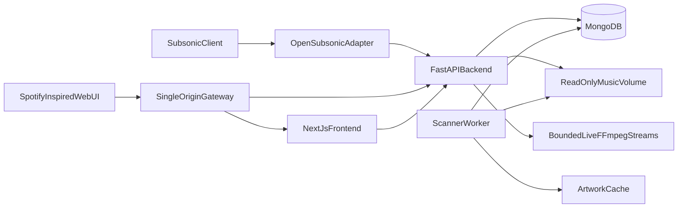

# Architecture

## Overview



dtp-tunes runs as five Docker Compose services, all on a private network
except the `gateway`, which is the single public origin:

- **gateway** (`nginx`) — routes `/` to `web`, and `/api`/`/rest`/`/health` to
  `api`, disabling response buffering on streaming/media paths so byte-range
  playback and live transcodes aren't held in memory. By default it publishes
  only `127.0.0.1:8080` for host diagnostics. With
  [`docker-compose.runtipi.yml`](../docker-compose.runtipi.yml), the gateway
  also joins Runtipi’s `runtipi_tipi_main_network` and Traefik terminates TLS
  for `${DTP_TUNES_DOMAIN}` (see [`RUNTIPI_DEPLOYMENT.md`](RUNTIPI_DEPLOYMENT.md)).
  Nginx preserves incoming `X-Forwarded-Proto` so session cookies stay `Secure`
  behind Traefik.
- **web** — a Next.js 16 App Router frontend (`web/`), built with
  `output: "standalone"` and served by its own minimal Node.js runtime.
  Client components fetch relative `/api/...` paths, which the browser sends
  to the gateway on the same origin (cookies included automatically).
- **api** — a FastAPI app (`api/app/main.py`) exposing:
  - `/api/*` — JSON endpoints for the Next.js frontend (cookie-session auth).
  - `/rest/*` — OpenSubsonic-compatible endpoints for third-party Subsonic
    clients (token/salt, legacy password, or API-key auth).
  - `/health` — used by the Docker healthcheck.
- **worker** — the *same image* as `api`, but running
  `python -m app.worker.main` instead of `uvicorn`. It leases scan jobs from
  MongoDB (`scanJobs` collection) and walks the music library, so long scans
  never block the HTTP process that serves streams.
- **mongodb** — the only stateful data store. No port is published by
  default.

## Backend layout (`api/app`)

```
app/
  main.py            FastAPI app, CORS, router registration, startup/shutdown
  config.py          pydantic-settings Settings (env-driven)
  db.py              motor client/database singleton + ensure_indexes()
  security.py        Argon2id hashing, AES-GCM secret encryption, tokens
  models.py           Pydantic request/response schemas (camelCase)
  deps.py            FastAPI dependencies: get_db, require_user, require_admin
  repositories/      One module per collection group; plain dict documents
    users.py, sessions.py, api_keys.py, catalog.py (artists/albums/songs/genres),
    playlists.py, social.py (stars/history/queues), scan_jobs.py
  services/
    auth_service.py       bootstrap, web login, API keys, legacy Subsonic auth
    media.py               byte-range streaming + bounded FFmpeg transcoding
    cover_art.py           cached artwork resolution/resizing
    subsonic_format.py     OpenSubsonic JSON/XML envelopes + error codes
    subsonic_entities.py   Mongo doc -> OpenSubsonic entity dict mapping
  routes/
    health.py, api_auth.py, api_library.py, api_playlists.py, api_player.py,
    api_media.py, api_admin.py, subsonic.py, subsonic_params.py
  worker/
    main.py       lease loop (try_lease_next_job / renew_lease / complete_job)
    scanner.py    filesystem walk, dedupe by (mtime, size), reconciliation
    tags.py       Mutagen tag extraction + embedded/sidecar artwork lookup
    artwork.py    Pillow resize + cache write
```

Domain logic (repositories, services, worker) is shared between the `api`
and `worker` processes so both stay consistent without duplicating queries.

## Data model (MongoDB, camelCase fields, opaque `uuid4().hex` IDs)

dtp-tunes lives in the shared `DTP` database (`MONGODB_DB`) and namespaces
every collection with the `tunes_` prefix (`MONGODB_COLLECTION_PREFIX`), so
`users` below is physically `tunes_users`, `scanJobs` is `tunes_scanJobs`,
etc. The prefix is applied in one place (`PrefixedDatabase` in
`api/app/db.py`); repository code keeps using the logical names.

| Collection    | Purpose                                                              | Key indexes |
| ------------- | --------------------------------------------------------------------- | ----------- |
| `users`       | accounts, Argon2id `passwordHash`, AES-GCM `subsonicSecretEncrypted` | unique `normalizedUsername` |
| `apiKeys`     | revocable `{keyId}.{secret}` API keys, Argon2id-hashed secret        | unique `keyId` |
| `sessions`    | opaque cookie session tokens (SHA-256 hash stored, not the token)    | TTL index on `expiresAt` |
| `artists`     | normalized artist names, `albumCount`                                | `normalizedName` |
| `albums`      | per-artist albums, `coverArtPath` (cache-relative), `songCount`      | `artistId`, `normalizedName` |
| `songs`       | one doc per audio file, unique `path`, tags, `fileMtime`/`fileSize`  | unique `path`, `albumId`, `artistId`, `genre` |
| `genres`      | derived rollup of song/album counts per genre                        | unique `name` |
| `playlists`   | ordered `songIds`, `ownerId`, `public`                                | `ownerId` |
| `stars`       | `(userId, itemId, itemType)` favorites for songs/albums/artists      | unique compound |
| `playHistory` | scrobble log per user                                                 | `(userId, playedAt)` |
| `playQueues`  | one saved queue per user (`current`, `position`, `songIds`)          | unique `userId` |
| `scanJobs`    | leased scan job documents (`status`, `leaseOwner`, `leaseExpiresAt`) | `status`, `leaseExpiresAt` |

Song identity is the relative file path under `/music`; moving/renaming a
file outside the app currently creates a new song identity (see
[`docs/V1_SCOPE.md`](V1_SCOPE.md)).

## Authentication

- **Web (Next.js)**: `/api/auth/login` verifies Argon2id, creates a
  `sessions` document, and sets an `httpOnly`, `SameSite=Lax` cookie
  (`SESSION_COOKIE_NAME`). `require_user`/`require_admin` FastAPI
  dependencies resolve the cookie on every request.
- **OpenSubsonic clients**: `authenticate_subsonic()` in
  `services/auth_service.py` supports, in order: API key (`apiKey=` or
  `X-Api-Key` header), token/salt (`t`/`s`, `t = MD5(secret + salt)`), and
  legacy plaintext/hex password (`p`). All three compare against a per-user
  **Subsonic compatibility secret** — a random value, unrelated to the web
  password, stored reversibly with AES-256-GCM under `APP_ENCRYPTION_KEY`.
  See [`docs/SUBSONIC_COMPATIBILITY.md`](SUBSONIC_COMPATIBILITY.md) for the
  full rationale and tradeoffs.

## Streaming and transcoding

- `stream_file_with_range()` (`services/media.py`) serves the original file
  with `Accept-Ranges`/`Content-Range` support so seeking works without
  buffering the whole file.
- `transcode_stream()` spawns `ffmpeg` per request, bounded by an
  `asyncio.Semaphore(FFMPEG_MAX_CONCURRENT)`; the process is killed when the
  client disconnects or the response iterator exits.
- Both are exposed twice: once cookie-authenticated under `/api/stream/*`
  (for the Next.js player) and once under `/rest/stream`/`/rest/download`
  for Subsonic clients.

## Scanning

The worker loop (`worker/main.py`) leases the oldest pending/expired job via
an atomic `find_one_and_update` (`scan_jobs.try_lease_next_job`), renews the
lease every file, and on completion reconciles deletions, recomputes
album/artist/genre rollups, and marks the job `completed`/`failed`. A new
job is enqueued automatically on first boot and on `SCAN_INTERVAL_SECONDS`.

## Frontend (`web/src`)

- `app/(main)/*` — authenticated pages (Home, Search, Library, Artist,
  Album, Playlist, Queue, Settings) behind `components/layout/AppShell.tsx`,
  which redirects to `/login` when `/api/auth/me` fails.
- `app/login` — standalone login page outside the shell.
- `store/playerStore.ts` — Zustand store owning queue/playback state.
- `components/player/AudioEngine.tsx` — the single `HTMLAudioElement` for
  the app; syncs with the store, reports progress, saves the queue to
  `/api/queue`, and wires up the Media Session API for OS-level controls.
- `components/ui/*` — small local primitives (Button, IconButton, Input,
  Skeleton, EmptyState, ErrorState) instead of a full component library.
- Styling: Tailwind CSS v4 via `@theme` tokens in `app/globals.css`
  (near-black/charcoal backgrounds, Spotify-green `--color-accent`,
  light-mode override via `prefers-color-scheme`).
